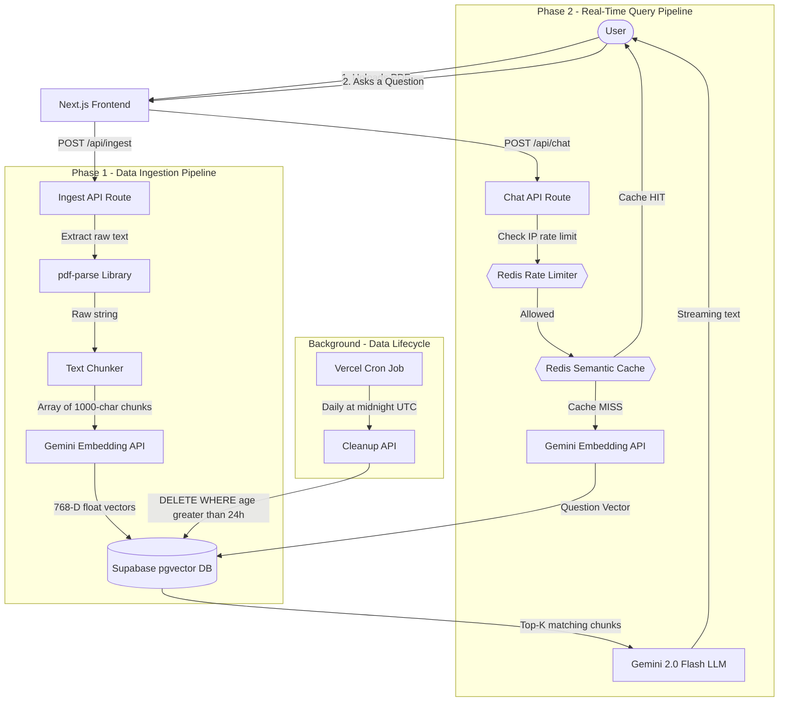
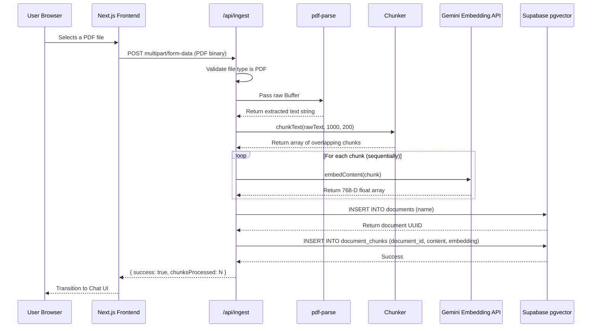
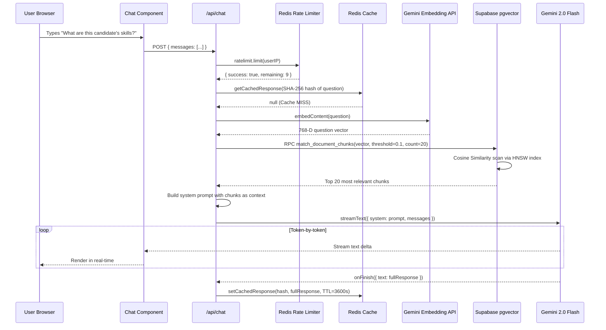

# Lexicon AI

A production-grade **Retrieval-Augmented Generation** platform that lets users upload any PDF document and ask natural language questions about its contents. The system extracts, chunks, vectorizes, and stores the document in a PostgreSQL vector database, then uses semantic search and a large language model to generate accurate, context-aware answers - all streamed in real-time.

> Built with Next.js, Supabase pgvector, Google Gemini, Upstash Redis, and the Vercel AI SDK.

---

## How It Works - The Complete Picture

At its core, this is a **two-phase system**: an **Ingestion Pipeline** that processes documents, and a **Query Pipeline** that answers questions. Both pipelines are protected by a Redis-backed rate limiter and enhanced by a semantic cache.

### High-Level System Architecture



---

## Deep Dive: The Data Flow

### Phase 1: Ingestion - What happens when you upload a PDF



#### Step-by-step breakdown:

1. **File Upload** - The user drags or selects a PDF. The frontend sends a `POST` request with `multipart/form-data` to `/api/ingest`.

2. **Text Extraction** - The API route reads the file into a Node.js `Buffer` and passes it to `pdf-parse`, which decodes the PDF binary format and returns a single raw text string.

3. **Text Chunking** - A single PDF can contain thousands of words. We can't send all of it to the LLM (token limits), so we split it into smaller chunks of **1,000 characters** each. Each chunk **overlaps the previous one by 200 characters** to prevent losing context at boundaries.

   ```
   Example: "The quick brown fox jumps over the lazy dog sits by the fire"
   
   Chunk 1: "The quick brown fox jumps over the la..."  (chars 0-1000)
   Chunk 2: "...mps over the lazy dog sits by the fi..."  (chars 800-1800)
                   ↑ 200-char overlap ↑
   ```

4. **Vectorization** - Each chunk is sent to Google Gemini's Embedding API (`text-embedding-004`), which converts the text into a **768-dimensional floating-point vector**. This vector is a mathematical representation of the chunk's *meaning* - not its exact words.

5. **Storage** - We first create a parent `documents` row (with the filename), then batch-insert all chunks + their vectors into the `document_chunks` table. The `pgvector` extension stores these vectors natively and indexes them using the HNSW algorithm for O(log n) retrieval.

---

### Phase 2: Query - What happens when you ask a question



#### Step-by-step breakdown:

1. **Rate Limiting** - Before anything happens, we extract the user's IP from the `x-forwarded-for` header and pass it through an Upstash Redis **Fixed-Window Rate Limiter**. If this IP has exceeded 10 requests in the last 60 seconds, we immediately return a `429 Too Many Requests` response - the request never reaches the LLM.

2. **Semantic Cache Check** - We normalize the question (lowercase, trim, strip punctuation), hash it with **SHA-256**, and check Redis for a cached response. If found (cache HIT), we instantly stream the cached text back to the user - zero LLM cost, near-zero latency.

3. **Question Vectorization** - On a cache MISS, we convert the user's question into a 768-D vector using the same Gemini Embedding API we used during ingestion.

4. **Vector Search (Cosine Similarity)** - We call a Supabase RPC function (`match_document_chunks`) that computes the **cosine similarity** between the question vector and every stored chunk vector. The top 20 closest chunks are returned, ranked by semantic relevance.

   ```
   Cosine Similarity = (A · B) / (|A| × |B|)
   
   Score of 1.0 = Identical meaning
   Score of 0.0 = Completely unrelated
   ```

5. **Augmented Prompt Construction** - We take the top 20 chunks, concatenate them with `---` separators, and inject them into a system prompt:
   ```
   "You are a helpful assistant. Use ONLY this provided context to answer.
   CONTEXT: [chunk1] --- [chunk2] --- [chunk3] ..."
   ```

6. **Streaming Response** - Gemini 2.0 Flash processes the augmented prompt and generates the answer. Using the Vercel AI SDK's `streamText()`, we stream each token to the frontend as it's generated - the user sees the response appear character-by-character in real-time.

7. **Cache Set** - After the stream completes, the `onFinish` callback saves the full response text to Redis with a 1-hour TTL. The next identical question will be served from cache.

---

## Project Structure

```
lexicon-ai/
├── src/
│   ├── app/
│   │   ├── api/
│   │   │   ├── ingest/route.ts    # PDF upload, text extraction, chunking, embedding
│   │   │   ├── chat/route.ts      # Rate limiting, caching, vector search, LLM streaming
│   │   │   └── cron/cleanup/route.ts  # Automated 24h data purge
│   │   ├── page.tsx               # Upload UI + chat screen transitions
│   │   └── globals.css            # Glassmorphism design system
│   ├── components/
│   │   └── Chat.tsx               # Chat interface with Markdown rendering
│   └── lib/
│       ├── chunking.ts            # Sliding-window text splitter with overlap
│       ├── gemini.ts              # Gemini embedding client wrapper
│       ├── redis.ts               # Redis client, rate limiter, semantic cache
│       └── supabase.ts            # Supabase client initialization
├── schema.sql                     # Database DDL: tables, indexes, RPC functions
├── vercel.json                    # Vercel cron job configuration
├── .env.local.example             # Required environment variables template
└── package.json
```

---

## Engineering Decisions & Tradeoffs

| Decision | Why |
|---|---|
| **Sequential embedding** instead of `Promise.all()` | Free-tier Gemini API has strict rate limits. Parallel requests would trigger HTTP 429 errors. We chose **reliability over speed**. |
| **Fixed-Window Rate Limiter** instead of Token Bucket | Simpler to reason about, lower Redis overhead. 10 req/min is sufficient for a demo; easily upgradable. |
| **SHA-256 exact-match cache** instead of vector similarity cache | Exact-match is deterministic and has zero false positives. Semantic similarity caching requires a separate vector index and introduces cache coherence complexity. |
| **`ON DELETE CASCADE`** on chunks | When a document expires, PostgreSQL automatically destroys all associated chunks and vectors at the database level - zero orphaned data, zero application-level cleanup code. |
| **Edge Runtime** for the chat route | Runs on Vercel's edge network (Cloudflare Workers), reducing cold start latency to near-zero for global users. |
| **1000/200 chunk size/overlap** | 1000 chars keeps chunks small enough to fit many into the LLM context window. 200-char overlap ensures no sentence is split without context. |

---

## Tech Stack

| Layer | Technology | Purpose |
|---|---|---|
| **Framework** | Next.js 14 (App Router) | Full-stack React framework with API routes |
| **Language** | TypeScript | Type safety across the entire codebase |
| **Vector Database** | Supabase (PostgreSQL + pgvector) | Store and search 768-D embeddings with HNSW indexing |
| **Cache + Rate Limit** | Upstash Redis (Serverless) | Exact-match query caching + IP-based rate limiting |
| **Embeddings** | Google Gemini `text-embedding-004` | Convert text to 768-D semantic vectors |
| **LLM** | Google Gemini 2.0 Flash | Generate context-aware answers from retrieved chunks |
| **AI SDK** | Vercel AI SDK | Streaming text protocol between server and client |
| **PDF Parsing** | pdf-parse | Extract raw text from PDF binary data |
| **Styling** | Tailwind CSS | Glassmorphism UI with animations |

---

## Getting Started

### Prerequisites
- Node.js 18+
- A [Supabase](https://supabase.com) project (free tier works)
- A [Google AI Studio](https://aistudio.google.com) API key
- An [Upstash](https://upstash.com) Redis database (optional - app works without it)

### Setup

```bash
# 1. Clone the repository
git clone https://github.com/your-username/lexicon-ai.git
cd lexicon-ai

# 2. Install dependencies
npm install

# 3. Configure environment variables
cp .env.local.example .env.local
# Then edit .env.local with your actual keys

# 4. Initialize the database
# Copy the contents of schema.sql and run it in your Supabase SQL Editor

# 5. Start the development server
npm run dev
```

### Environment Variables

| Variable | Required | Description |
|---|---|---|
| `NEXT_PUBLIC_SUPABASE_URL` | Yes | Your Supabase project URL |
| `SUPABASE_SERVICE_ROLE_KEY` | Yes | Supabase service role key (server-side only) |
| `GEMINI_API_KEY` | Yes | Google AI Studio API key |
| `UPSTASH_REDIS_REST_URL` | No | Upstash Redis REST URL (caching + rate limiting) |
| `UPSTASH_REDIS_REST_TOKEN` | No | Upstash Redis REST token |
| `CRON_SECRET` | No | Secret to protect the cleanup cron endpoint |

---

## Deployment (Vercel)

1. Push your code to GitHub.
2. Import the repository in [Vercel](https://vercel.com).
3. Add all environment variables from `.env.local` to the Vercel project settings.
4. Deploy - the cron job in `vercel.json` will automatically schedule the daily cleanup.
